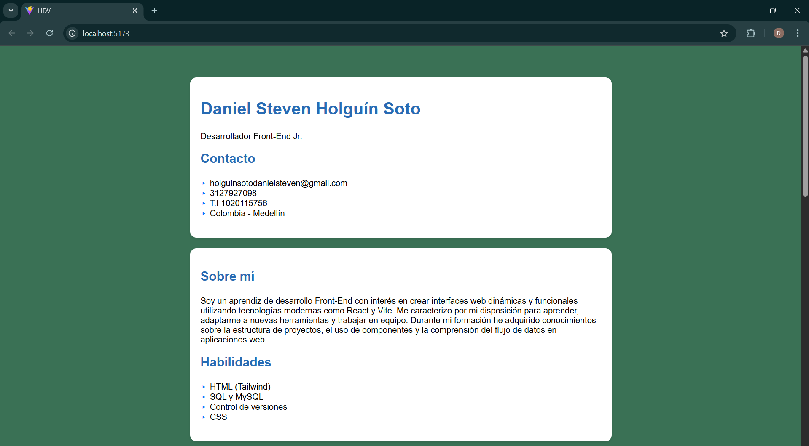
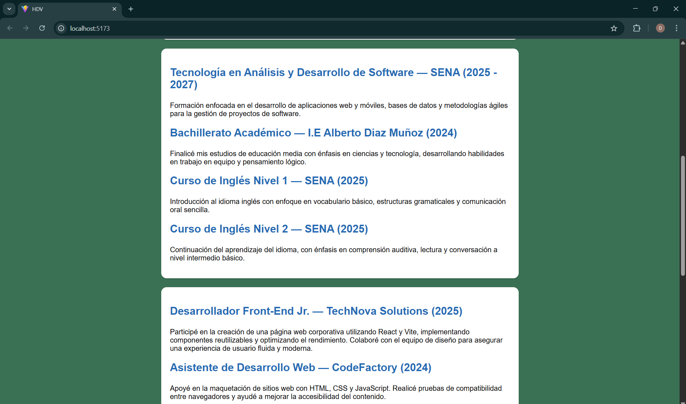
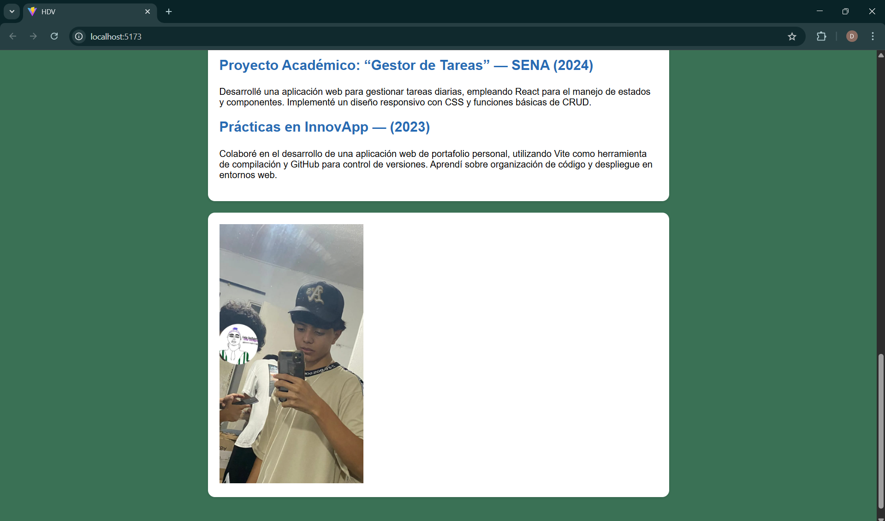
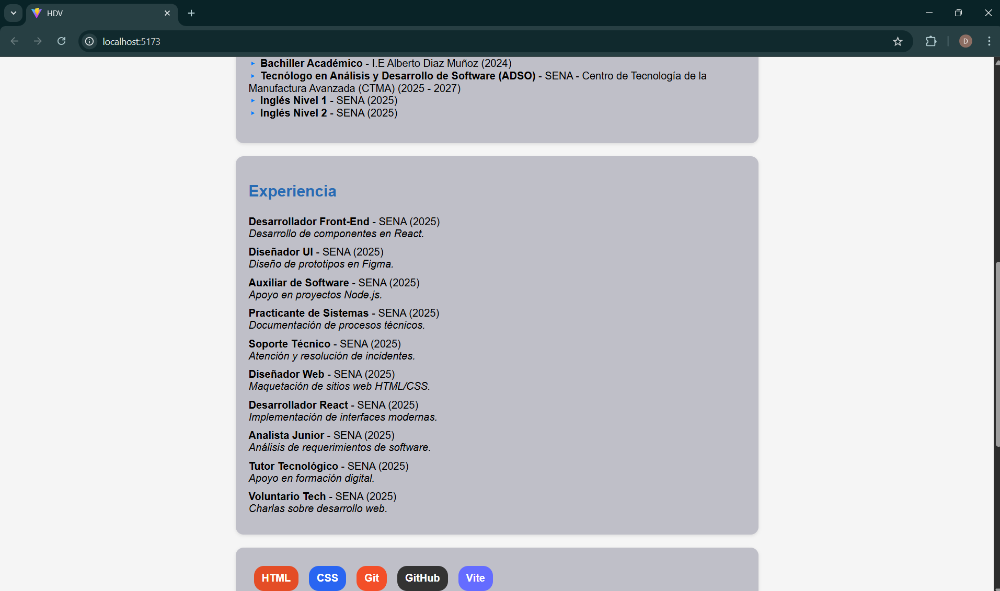

# Nombre del proyecto
Mi hoja de vida

# Interfaz grafica

# Instrucciones para ejecutar el proyecto
Primero se abre la terminal y se abre la carpeta con el comando cd exp_app, luego se pone otro comando que es npm run dev y por ultimo se abre el link del localhost.

# GA1-220501096-03-AA1-EV06-Construcción Componentes dinámicos en React – Renderizado 

# Breve descripcion del ejercicio
El objetivo fue aplicar el renderizado condicional y el renderizado de listas para crear componentes dinámicos que muestran información automáticamente desde arreglos (arrays) de datos.

# GA1-220501096-03-AA1-EV07 – Reutilización de componentes en React – Props y desestructuración con una hoja de vida dinámica

# Uso de props
En React, las props (propiedades) son la forma en que un componente puede recibir información desde otro componente. Funcionan como los “mensajes” o “datos” que el componente padre le envía al componente hijo para que este los use o los muestre en pantalla. Se pasan dentro de las etiquetas del componente, de manera similar a los atributos en HTML, y se reciben en el componente hijo como parámetros dentro de una función. Las props permiten que los componentes sean reutilizables y flexibles, ya que pueden mostrar información diferente sin tener que cambiar su código interno. Además, las props son solo de lectura, lo que significa que el componente hijo no puede modificarlas, solo utilizarlas para renderizar contenido dinámico. Por ejemplo, si en el componente principal se escribe <CabeceraCV nombre="Daniel" cargo="Aprendiz ADSO" />, el componente CabeceraCV puede mostrar esos datos en pantalla usando {nombre} y {cargo} dentro de su estructura.