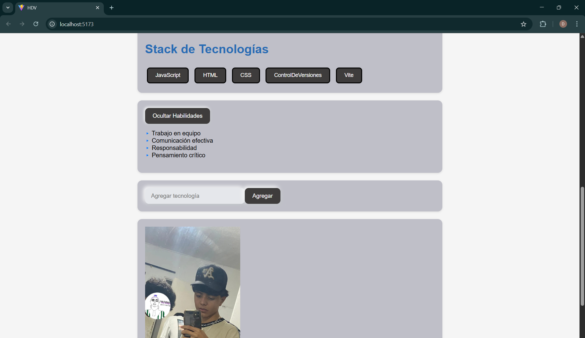

# Nombre del proyecto
Mi hoja de vida

# Interfaz grafica

# GA1-220501096-03-AA1-EV06-Construcción Componentes dinámicos en React – Renderizado 

# Breve descripcion del ejercicio
El objetivo fue aplicar el renderizado condicional y el renderizado de listas para crear componentes dinámicos que muestran información automáticamente desde arreglos (arrays) de datos.

# GA1-220501096-03-AA1-EV07 – Reutilización de componentes en React – Props y desestructuración con una hoja de vida dinámica

# Uso de props
En React, las props (propiedades) son la forma en que un componente puede recibir información desde otro componente. Funcionan como los “mensajes” o “datos” que el componente padre le envía al componente hijo para que este los use o los muestre en pantalla. Se pasan dentro de las etiquetas del componente, de manera similar a los atributos en HTML, y se reciben en el componente hijo como parámetros dentro de una función. Las props permiten que los componentes sean reutilizables y flexibles, ya que pueden mostrar información diferente sin tener que cambiar su código interno. Además, las props son solo de lectura, lo que significa que el componente hijo no puede modificarlas, solo utilizarlas para renderizar contenido dinámico. Por ejemplo, si en el componente principal se escribe <CabeceraCV nombre="Daniel" cargo="Aprendiz ADSO" />, el componente CabeceraCV puede mostrar esos datos en pantalla usando {nombre} y {cargo} dentro de su estructura.

# Proyecto: CV Interactivo en React – Eventos y Estado Local (EV08)

# Descripción del proyecto
En este proyecto se añadieron varias funciones clave para implementar el manejo de eventos y el estado local en React. En primer lugar, se creó la función agregarTecnologia dentro del componente principal App.jsx, la cual se encarga de recibir una nueva tecnología desde el formulario y actualizar el estado del arreglo tecnologias, logrando que cada tecnología digitada por el usuario se renderice dinámicamente en pantalla. También se añadió la función que administra el estado del input dentro del componente FormularioTecnologia.jsx, permitiendo controlar el valor ingresado por el usuario y limpiar el campo después de enviar la información. Además, se implementó la función anónima que maneja el evento onSubmit, encargada de prevenir el comportamiento por defecto del formulario, validar el dato ingresado y enviar la información hacia el componente padre utilizando una función callback.

Por otro lado, en el componente ToggleHabilidades.jsx se añadió la función que administra el estado booleano mostrar, la cual permite alternar entre mostrar y ocultar la sección de habilidades mediante un evento onClick. Esta función, al cambiar su valor, activa el renderizado condicional que determina si el componente Habilidades.jsx debe visualizarse o no en la interfaz. Todas estas funciones trabajan de manera conjunta para gestionar la interacción del usuario, actualizar la interfaz en tiempo real y demostrar el uso del estado local, el manejo de eventos y la comunicación entre componentes mediante props y funciones callback.

# Interfaz grafica

## Pasos para ejecutar el proyecto
Primero se abre la terminal y se abre la carpeta con el comando cd exp_app, luego se pone otro comando que es npm run dev y por ultimo se abre el link del localhost.